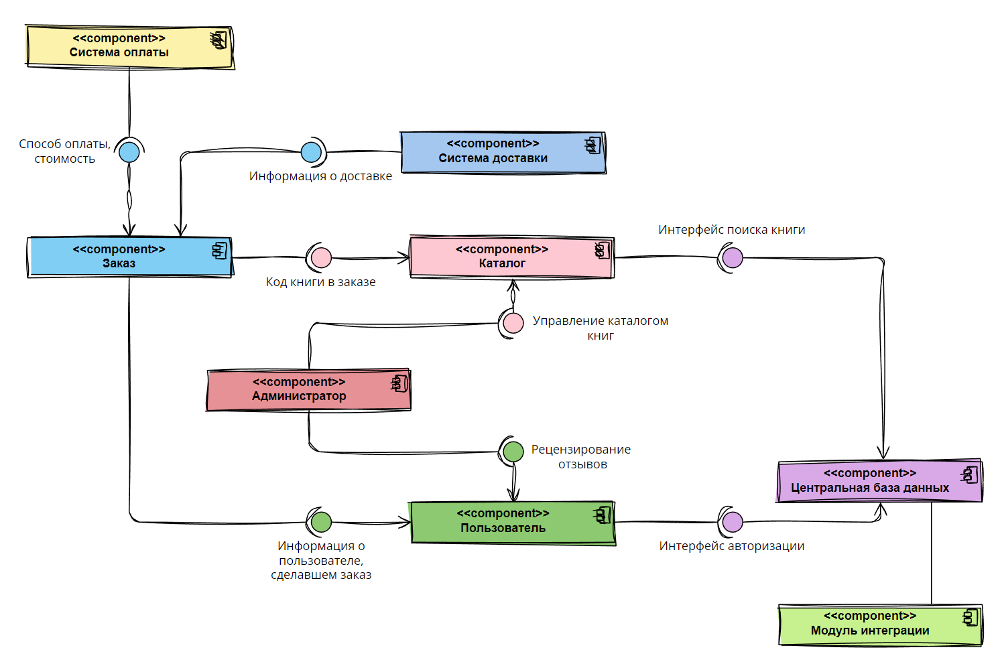

# Домашнее задание 11
# Леднева, Сабирова

## Диаграмма компонент

## Диаграмма классов

## Смысловое ядро:

1. Пользователь:

- Отвечает за учетные записи пользователей.
- Содержит информацию о пользователях.
- Обеспечивает аутентификацию и авторизацию пользователей.
- Позволяет пользователям создавать список желаемых покупок.
- Предоставляет возможность оформления заказа и оплаты.
- Позволяет пользователям управлять корзиной и заказами.
- Позволяет пользователям оставлять отзывы на книги.

2. Каталог:

- Содержит информацию о книгах.
- Предоставляет возможность поиска книг по различным критериям из информации о книгах.
- Позволяет пользователям оставлять отзывы на книги.
- Позволяет модерировать и публиковать отзывы и редакторские отзывы о книгах.

3. Заказ:

- Отвечает за управление заказами пользователей.
- Содержит информацию о заказе.
- Позволяет пользователям оформлять, изменять и отменять заказы.
- Предоставляет возможность оплаты заказа кредитной картой или по счету на оплату.
- Обеспечивает связь с системой доставки и отслеживание статуса доставки.

4. Система доставки:

- Отвечает за взаимодействие с внешними сущностями, связанными с доставкой заказов.
- Предоставляет интерфейс для доставки заказов.
- Обеспечивает отслеживание статуса доставки заказов.

5. Система оплаты:

- Отвечает за взаимодействие с внешними сущностями, связанными с оплатой заказов.
- Предоставляет интерфейс для проведения оплаты заказа кредитной картой или по счету на оплату.
- Обеспечивает обработку платежей и подтверждение успешной оплаты.

6. Администратор:

- Позволяет администраторам управлять каталогом книг, отзывами и редакторскими отзывами.
- Предоставляет интерфейс для модерации и управления отзывами.

7. Книга и ее характеристики
8. Отзыв и его характеристики

## Внешние компоненты:

9. Модуль интеграции:

- Отвечает за интеграцию с другими системами и интерфейсами (веб-сервисы и т.п.).
- Позволяет встраивать интернет-магазин на сайты партнеров в виде мини-каталога на основе центральной базы данных.
- Обеспечивает генерацию XML-файлов для передачи мини-каталога между системами.

10. Центральная база данных:
- Хранит основной список учетных записей пользователей.
- Сохраняет пароли пользователей для сверки при входе.
- Обеспечивает доступ к данным учетных записей для аутентификации пользователей.
- Хранит информацию о книгах и их характеристиках.
